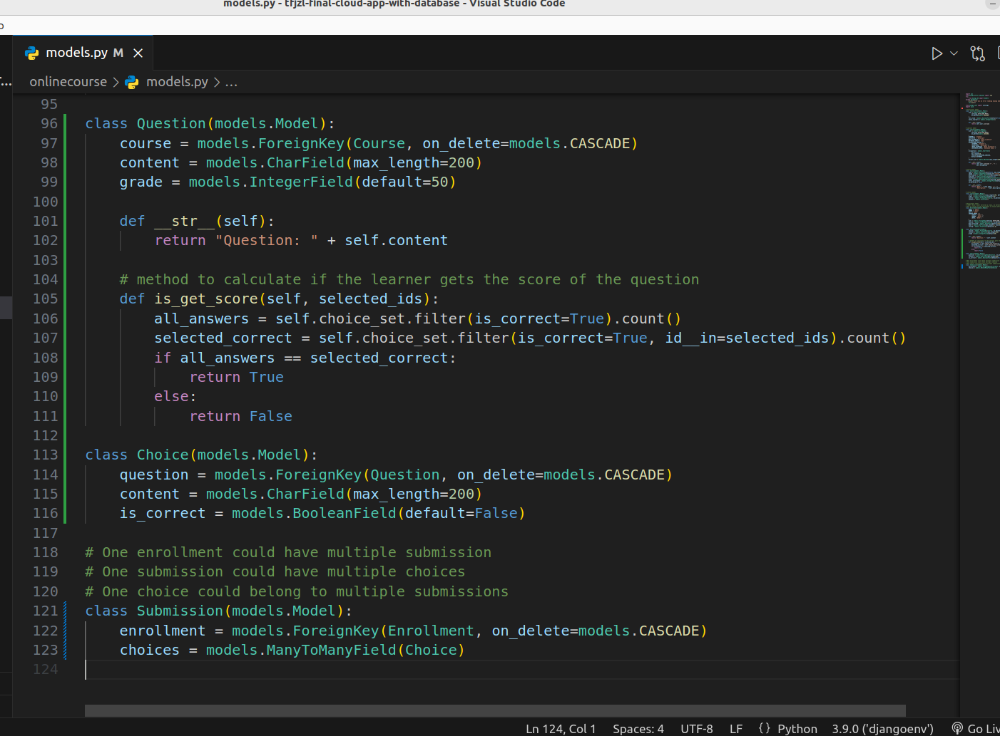
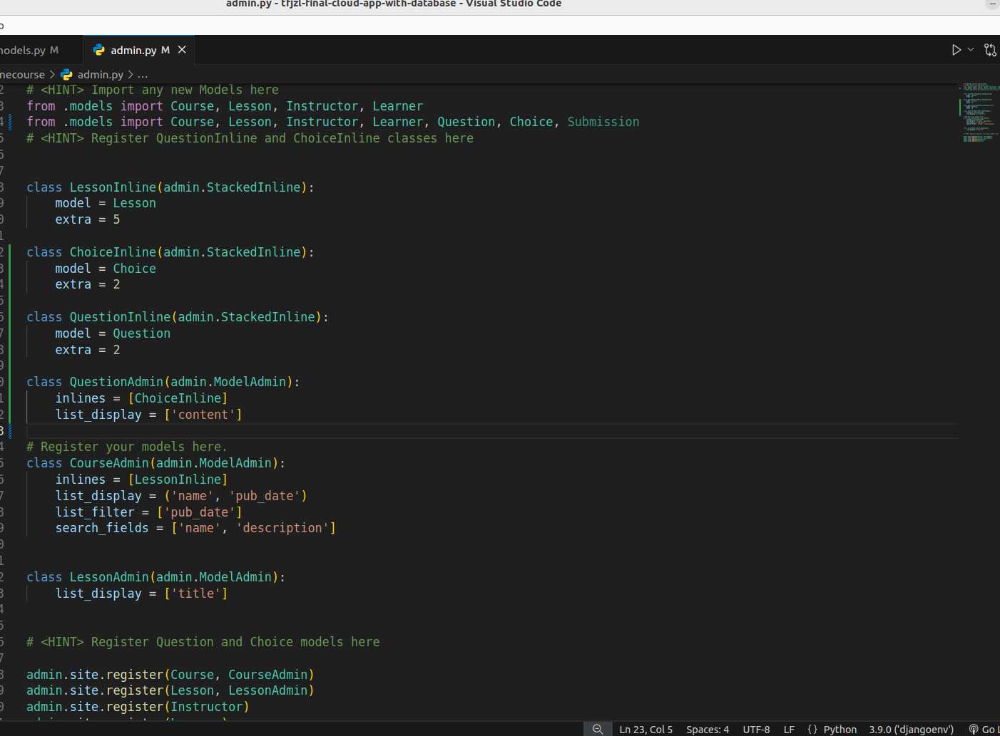
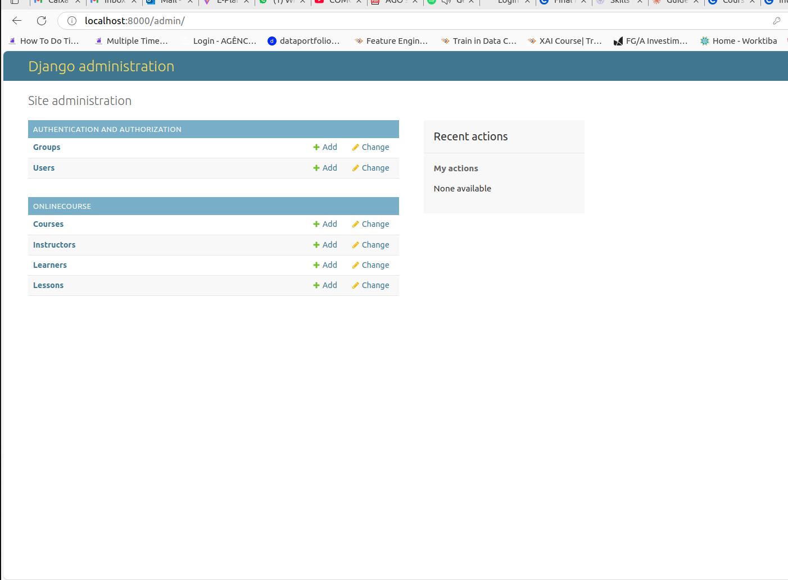
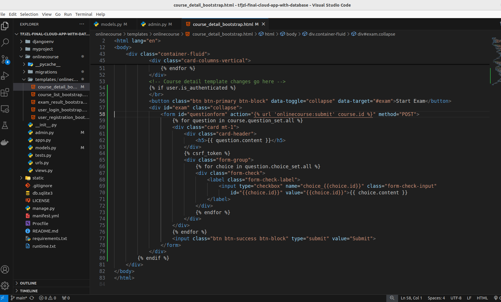
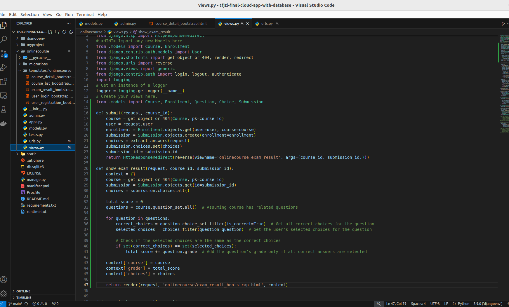
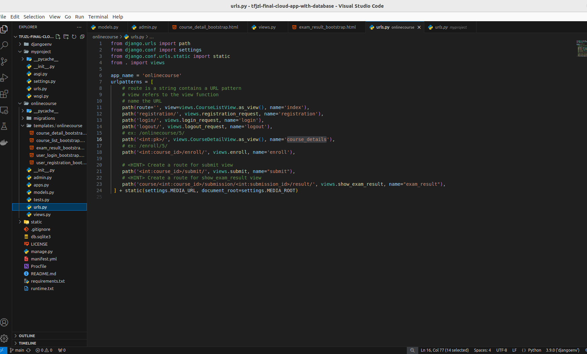
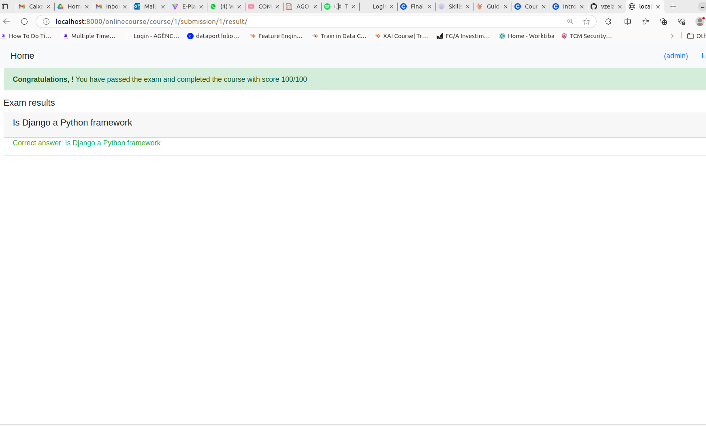

# Final Project of the Course Creating Django Applications from the IBM Full-Stack Developer Certification Program

**General Notes**

An `onlinecourse` app has already been provided in this repo upon which you will be adding a new assesement feature.

- If you want to develop the final project on Theia hosted by [IBM Developer Skills Network](https://labs.cognitiveclass.ai/), you will need to create the same project structure on Theia workspace and save it everytime you close the browser
- Or you could develop the final project locally by setting up your own Python runtime and IDE
- Hints for the final project are left on source code files
- You may choose any cloud platform for deployment (default is IBM Cloud Foundry)
- Depends on your deployment, you may choose any SQL database Django supported such as SQLite3, PostgreSQL, and MySQL (default is SQLite3)

**ER Diagram**
For your reference, we have prepared the ER diagram design for the new assesement feature.


As a newly onboarded full-stack developer, your lead developer has entrusted you with implementing a new course assessment feature. To successfully deliver this
feature, you will use your Django full-stack skills to design and develop the necessary models, templates, and views. Finally, you will run and thoroughly test your
online course application to ensure its functionality.

## Objectives
By the end of this lab you will be able to:
1. Understand the requirements of the new course assessment feature
2. Create question, choice, and submission models
3. Create a new course object with exam related models using the admin site
4. Update the course details template to show questions and choices
5. Create a new exam result template to show the result of the submission
6. Create a new exam result submission view
7. Create a new view to display and evaluate exam result

### Task 1: Build New Models
Django models were created in /onlinecourse/models.py

**Question model**:
A Question model will save the questions of an exam with the following characteristics:
- Used to persist questions for a course;
- Has a Many-To-One relationship with the course;
- Has question text;
- Has a grade point for each question.
A code snippet of the above is like this

```
class Question(models.Model):
    course = models.ForeignKey(Course, on_delete=models.CASCADE)
    content = models.CharField(max_length=200)
    grade = models.IntegerField(default=50)
```



### Task 2: Register Model Changes
Now, the changes will be made to onlinecourse/admin.py in order to use the new features that were built.
For instance, for the **Question**:

```
class LessonInline(admin.StackedInline):
    model = Lesson
    extra = 5

class ChoiceInline(admin.StackedInline):
    model = Choice
    extra = 2

class QuestionInline(admin.StackedInline):
    model = Question
    extra = 2

class CourseAdmin(admin.ModelAdmin):
    inlines = [LessonInline]
    list_display = ('name', 'pub_date')
    list_filter = ['pub_date']
    search_fields = ['name', 'description']


class QuestionAdmin(admin.ModelAdmin):
    inlines = [ChoiceInline]
    list_display = ['content']

admin.site.register(Question, QuestionAdmin)
```



Below is shown the screenshot of the admin site



### Task 3: Update the Course Detail Template

You will now update the course detail template to create an exam section with a list of questions and choices.
One exam contains multiple questions, and each should have more than one correct answer (multiple-selection).

For instance, add *UI* questions:

```
<div class="card mt-1">
    <div class="card-header"><h5>{{ question.content }}</h5></div>
        
        <div class="form-group">
        <!-- Choices components go here -->
    </div>
</div>
```



### Task 4: Test Data
You will now create test data for your application.


### Task 5: Submission Evaluation
Since you have created several new models, you now need to import them at the top of the views.py

#### Evaluation view
Create an exam result view def show_exam_result(**request, course_id, submission_id**): to check if the learner passed the exam and their question results.
You may implement the view based on the following logic:
- Get the course object and submission object based on their ids in view arguments;
- Get the selected choice ids from the submission record;
- For each selected choice, check if it is a correct answer or not
Calculate the total score by adding up the grades for all questions in the course;
- Add the course, choice, and grade to context for rendering HTML page
Configure urls.py to route the new show_exam_result view such as path('course/<int:course_id>/submission/<int:submission_id>/result/',
...).

```
def show_exam_result(request, course_id, submission_id):
    context = {}
    course = get_object_or_404(Course, pk=course_id)
    submission = Submission.objects.get(id=submission_id)
    choices = submission.choices.all()
    total_score = 0
    questions = course.question_set.all() # Assuming course has related questions
    for question in questions:
        # Get all correct choices for the question
        correct_choices = question.choice_set.filter(is_correct=True) 
        # Get the user's selected choices for the question
        selected_choices = choices.filter(question=question) 
        # Check if the selected choices are the same as the correct choices
        if set(correct_choices) == set(selected_choices):
            # Add the question's grade only if all correct answers are selected
            total_score += question.grade 
            context['course'] = course
            context['grade'] = total_score
            context['choices'] = choices
    return render(request, 'onlinecourse/exam_result_bootstrap.html', context)
```




### Task 6: Complete the Exam Result Template to Show Exam Submission Results

Complete the HTML template exam_result_bootstrap.html for submission results which should show if a learner passed the exam with details like the total score,
the result for each question, and so on. Check the previous UI design for more details.
Stylize the updated template with Bootstrap to meet the UI design from the design team.
Pass output
Learners who pass the exam should be shown the final score and a congratulations message
```
<b>Congratulations, {{ user.first_name }}!</b> You have passed the exam and completed the course with score {{ grade }}/100
```



Below, it is shown a screen capture of a result from the mock exam.




# Contributor Covenant Code of Conduct

## Our Pledge

We as members, contributors, and leaders pledge to make participation in our
community a harassment-free experience for everyone, regardless of age, body
size, visible or invisible disability, ethnicity, sex characteristics, gender
identity and expression, level of experience, education, socio-economic status,
nationality, personal appearance, race, caste, color, religion, or sexual
identity and orientation.

We pledge to act and interact in ways that contribute to an open, welcoming,
diverse, inclusive, and healthy community.

## Our Standards

Examples of behavior that contributes to a positive environment for our
community include:

* Demonstrating empathy and kindness toward other contributions that are not aligned with this Code of Conduct, and will communicate reasons for moderation decisions when appropriate.

## Scope

This Code of Conduct applies within all community spaces, and also applies when
an individual, or aggression toward or disparagement of classes of individuals.

**Consequence**: A permanent ban from any sort of public interaction within the
community.

## Attribution

This Code of Conduct is adapted from the [Contributor Covenant][homepage],
version 2.1, available at
[https://www.contributor-covenant.org/version/2/1/code_of_conduct.html][v2.1].

Community Impact Guidelines were inspired by
[Mozilla's code of conduct enforcement ladder][Mozilla CoC].

For answers to common questions about this code of conduct, see the FAQ at
[https://www.contributor-covenant.org/faq][FAQ]. Translations are available at
[https://www.contributor-covenant.org/translations][translations].

[homepage]: https://www.contributor-covenant.org
[v2.1]: https://www.contributor-covenant.org/version/2/1/code_of_conduct.html
[Mozilla CoC]: https://github.com/mozilla/diversity
[FAQ]: https://www.contributor-covenant.org/faq
[translations]: https://www.contributor-covenant.org/translations is officially representing the community in public spaces.
Examples of representing our community include using an official e-mail address,
posting via an official social media account, or acting as an appointed
representative at an online or offline event.

## Enforcement

Instances of abusive, harassing, or otherwise unacceptable behavior may be
reported to the community leaders responsible for enforcement at
[INSERT CONTACT METHOD].
All complaints will be reviewed and investigated promptly and fairly.

All community leaders are obligated to respect the privacy and security of the
reporter of any incident.

## Enforcement Guidelines

Community leaders will follow these Community Impact Guidelines in determining
the consequences for any action they deem in violation of this Code of Conduct:

### 1. Correction

**Community Impact**: Use of inappropriate language or other behavior deemed
unprofessional or unwelcome in the community.

**Consequence**: A private, written warning from community leaders, providing
clarity around the nature of the violation and an explanation of why the
behavior was inappropriate. A public apology may be requested.

### 2. Warning

**Community Impact**: A violation through a single incident or series of
actions.

**Consequence**: A warning with consequences for continued behavior. No
interaction with the people involved, including unsolicited interaction with
those enforcing the Code of Conduct, for a specified period of time. This
includes avoiding interactions in community spaces as well as external channels
like social media. Violating these terms may lead to a temporary or permanent
ban.

### 3. Temporary Ban

**Community Impact**: A serious violation of community standards, including
sustained inappropriate behavior.

**Consequence**: A temporary ban from any sort of interaction or public
communication with the community for a specified period of time. No public or
private interaction with the people involved, including unsolicited interaction
with those enforcing the Code of Conduct, is allowed during this period.
Violating these terms may lead to a permanent ban.

### 4. Permanent Ban

**Community Impact**: Demonstrating a pattern of violation of community
standards, including sustained inappropriate behavior, harassment of an
individual people
* Being respectful of differing opinions, viewpoints, and experiences
* Giving and gracefully accepting constructive feedback
* Accepting responsibility and apologizing to those affected by our mistakes,
  and learning from the experience
* Focusing on what is best not just for us as individuals, but for the overall
  community

Examples of unacceptable behavior include:

* The use of sexualized language or imagery, and sexual attention or advances of
  any kind
* Trolling, insulting or derogatory comments, and personal or political attacks
* Public or private harassment
* Publishing others' private information, such as a physical or email address,
  without their explicit permission
* Other conduct which could reasonably be considered inappropriate in a
  professional setting

## Enforcement Responsibilities

Community leaders are responsible for clarifying and enforcing our standards of
acceptable behavior and will take appropriate and fair corrective action in
response to any behavior that they deem inappropriate, threatening, offensive,
or harmful.

Community leaders have the right and responsibility to remove, edit, or reject
comments, commits, code, wiki edits, issues, and other